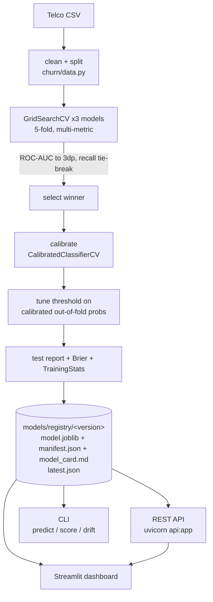

# 📊 Customer Churn Prediction System

A production-shaped churn service: a **calibrated** scikit-learn model behind a
**versioned model registry**, served in **real time over a FastAPI REST API**,
with **batch scoring**, **input validation + drift monitoring**, **structured
logs + Prometheus metrics**, a Streamlit dashboard, containers and CI.

> 📖 **[PROJECT_GUIDE.md](PROJECT_GUIDE.md)** — full walkthrough of the logic, algorithm, setup and every run command.

```bash
.\.venv\Scripts\Activate.ps1        # activate the venv (see Setup)
python -m churn train               # train, calibrate, register a model
python -m churn serve               # REST API on http://localhost:8000  (docs at /docs)
streamlit run app.py               # dashboard on http://localhost:8501
```

[](https://www.python.org/)
[](https://streamlit.io/)
[](https://scikit-learn.org/)
[](https://pandas.pydata.org/)
[](LICENSE)

---

## 📑 Table of Contents
1. [Business Use Case](#-business-use-case)
2. [Sample Services / Modules](#-sample-services--modules)
3. [Tasks to be Done](#-tasks-to-be-done)
4. [Key Features](#-key-features)
5. [Architecture & Workflow](#-architecture--workflow)
6. [Dataset Overview](#-dataset-overview)
7. [Exploratory Data Analysis (EDA)](#-exploratory-data-analysis-eda)
8. [Machine Learning Pipeline](#-machine-learning-pipeline)
   - [Data Cleaning & Feature Engineering](#data-cleaning--feature-engineering)
   - [Model Training & Selection](#model-training--selection)
   - [Model Persistence](#model-persistence)
9. [Project Structure](#-project-structure)
10. [Installation & Setup](#-installation--setup)
11. [How to Run](#-how-to-run)
   - [1. Train, calibrate and register a model](#1-train-calibrate-and-register-a-model)
   - [2. Real-time REST API](#2-real-time-rest-api)
   - [3. Terminal prediction](#3-terminal-prediction)
   - [4. Batch scoring & drift](#4-batch-scoring--drift)
   - [5. Model registry](#5-model-registry)
   - [6. Streamlit dashboard](#6-streamlit-dashboard)
   - [7. Containers](#7-containers)
   - [8. Tests & lint](#8-tests--lint)
12. [Risk Assessment & Business Actions](#-risk-assessment--business-actions)
13. [Technologies Used](#-technologies-used)
14. [Team Details](#-team-details)
15. [Contributing & License](#-contributing--license)

---

## 💼 Business Use Case

> The company requires an automated **Customer Churn Prediction System** to identify customers who are likely to stop using its products or services. The system must collect and analyze customer data such as usage behavior, subscription details, purchase history, and customer interactions. It should preprocess the data, perform exploratory data analysis, and use Machine Learning techniques to predict the probability of customer churn. The system should provide meaningful insights and visualizations to help the company take proactive actions to retain customers.

---

## 🧩 Services / Modules

| Service / Module | Implementation | Description |
| :--- | :--- | :--- |
| **Data & Preprocessing** | `churn/data.py`, `churn/features.py` | Cleaning, feature engineering, imputation, scaling and encoding as one scikit-learn `Pipeline`. |
| **Training & Calibration** | `churn/model.py`, `churn/evaluate.py`, `churn/train.py` | Grid-searched candidate models, CV selection by ROC-AUC, probability calibration, decision-threshold tuning, held-out evaluation with Brier score. |
| **Model Registry** | `churn/registry.py`, `models/registry/` | Versioned model storage with provenance manifests, `latest` pointer, `promote` for rollback. |
| **Inference** | `churn/predict.py`, `churn/batch.py` | `ChurnModel` scoring (probability, tier, drivers, warnings), single + vectorised batch. |
| **Validation & Monitoring** | `churn/validation.py` | Per-request input validation against the training envelope; Population Stability Index drift reports; JSONL prediction audit log. |
| **REST API** | `churn/service/`, `api.py` | FastAPI real-time scoring: `/predict`, `/predict/batch`, `/health`, `/model`, `/metrics`; request ids, structured logs. |
| **Dashboard** | `app.py`, `churn/app_ui.py` (Streamlit) | Interactive form for all 19 attributes; scores locally or via the API. |
| **Ops** | `Dockerfile`, `docker-compose.yml`, `.github/workflows/ci.yml`, `Makefile` | Containers, CI (lint + test + train smoke), task runner. |

---

## 📋 Tasks to be Done

Execution roadmap and completion status across project phases:

- [x] **1. Collect and preprocess customer data**: Clean `TotalCharges`, drop IDs, decode the target (`churn/data.py`); engineering, imputation, scaling and encoding packaged as a `Pipeline` (`churn/features.py`).
- [x] **2. Perform Exploratory Data Analysis (EDA)**: Distribution plots, churn correlations and demographic insights (`notebooks/customer_churn_eda.ipynb`).
- [x] **3. Identify important factors affecting customer churn**: Key drivers surfaced globally (`models/model_card.md`) and per-prediction in the CLI / dashboard.
- [x] **4. Develop and train a Machine Learning model**: Grid-searched Logistic Regression, Random Forest and HistGradientBoosting on stratified splits (`churn/model.py`, `churn/train.py`).
- [x] **5. Evaluate the model using suitable performance metrics**: 5-fold CV ROC-AUC / PR-AUC / F1 / recall, held-out test report, **probability calibration** (Brier + reliability), tuned decision threshold.
- [x] **6. Develop an interactive Streamlit dashboard**: all 19 attributes, explainable result, local-model or remote-API mode.
- [x] **7. Display customer churn predictions and insights**: probability, risk tier, recommended action, per-customer drivers, input warnings.
- [x] **8. Test the system**: 65-case pytest suite (data, features, calibration, registry, validation, batch, API) plus `ruff`; GitHub Actions CI.
- [x] **9. Deploy the application**: **real-time REST API** (`uvicorn api:app`), **model registry with rollback**, **batch scoring**, **drift monitoring**, `Dockerfile` + `docker-compose` (API + dashboard).

---

## 🌟 Key Features

- **Real-time REST API** (`FastAPI`): `POST /predict` returns probability, tier, drivers and warnings in ~10–25 ms; `/predict/batch`, `/health`, `/model`, `/metrics`. Pydantic-validated contract generated from one schema.
- **Model registry + versioning**: every training run is registered as `models/registry/<version>/` with a full provenance manifest (git SHA, data hash, library versions, metrics). `promote` for instant rollback; pin a version with `CHURN_MODEL_VERSION`.
- **Calibrated probabilities**: the winner is wrapped in `CalibratedClassifierCV` (sigmoid/isotonic chosen by CV Brier) so the risk-tier bands mean something. Brier score + reliability curve in the model card.
- **Input validation + drift monitoring**: each prediction returns `warnings` for out-of-range / unseen values; `churn drift` computes per-feature PSI vs. the training distribution; optional JSONL audit log of every prediction.
- **Single-Pipeline Architecture**: engineering, imputation, scaling and encoding are one scikit-learn `Pipeline` — no train/serve skew, unseen categories handled.
- **Cross-Validated Model Selection**: grid-searched Logistic Regression / Random Forest / HistGradientBoosting, 5-fold CV, ranked by ROC-AUC with a recall tie-break.
- **Observability + containers + CI**: structured JSON logs with request ids, Prometheus metrics, `Dockerfile` + `docker-compose` (API + dashboard), GitHub Actions, `Makefile`.
- **Tested**: 65 pytest cases (data, features, calibration, registry, validation, batch, API); `ruff`-clean.

---

## 🏗 Architecture & Workflow



---

## 📊 Dataset Overview

The project uses the **Telco Customer Churn** dataset (`data/Telco-Customer-Churn.csv`), containing **7,043 customer records** with **21 attributes**:

| Category | Attributes |
| :--- | :--- |
| **Customer Identification** | `customerID` (dropped during preprocessing) |
| **Demographics** | `gender`, `SeniorCitizen`, `Partner`, `Dependents` |
| **Account Information** | `tenure` (months), `Contract`, `PaperlessBilling`, `PaymentMethod`, `MonthlyCharges`, `TotalCharges` |
| **Subscribed Services** | `PhoneService`, `MultipleLines`, `InternetService`, `OnlineSecurity`, `OnlineBackup`, `DeviceProtection`, `TechSupport`, `StreamingTV`, `StreamingMovies` |
| **Target Variable** | `Churn` (`Yes` / `No`) |

---

## 🔍 Exploratory Data Analysis (EDA)

Located in [`notebooks/customer_churn_eda.ipynb`](notebooks/customer_churn_eda.ipynb), the analysis uncovers several key patterns:
- **Contract Type**: Customers on **Month-to-month contracts** exhibit significantly higher churn rates compared to those on 1-year or 2-year agreements.
- **Tenure**: Customers in their first 6–12 months have the highest attrition risk; churn drops precipitously as tenure increases.
- **Internet Service**: Fiber optic internet subscribers churn at higher rates, often correlated with higher monthly charges and service complaints.
- **Payment Method**: Customers paying via **Electronic Check** churn substantially more than those with automated payments (Bank Transfer / Credit Card).
- **Add-on Services**: Tech Support and Online Security services act as strong retention anchors.

---

## ⚙️ Machine Learning Pipeline

All preprocessing lives **inside a single scikit-learn `Pipeline`**, so it is refit
on every cross-validation fold and travels with the saved model — training and
serving can never encode a customer differently.

### Data Cleaning (`churn/data.py`)
1. **Identifier Removal**: `customerID` dropped (no predictive signal).
2. **Type Coercion**: `TotalCharges` coerced from string to float (11 blank rows become `NaN`).
3. **Target Decoding**: `Churn` mapped from `Yes`/`No` to `1`/`0`.

### Feature Engineering & Preprocessing (`churn/features.py`)
4. **Engineered features**: `tenure_group` (bucketed tenure), `has_internet`, `num_addons` (count of the six add-on services). Row-local and robust to partial input — no fragile ratios.
5. **Imputation**: median for numerics, most-frequent for categoricals — fit per fold.
6. **Scaling**: `StandardScaler` on numeric columns.
7. **Encoding**: `OneHotEncoder(handle_unknown="ignore")` — an unseen category at inference becomes an all-zero group instead of corrupting the row (no manual column re-indexing).

### Model Training & Selection (`churn/train.py`, `churn/evaluate.py`)
Candidate models, each a full pipeline with `class_weight="balanced"` (the target is only ~27% churn):
- **Logistic Regression** — linear baseline, `C` tuned.
- **Random Forest** — depth / leaf size tuned.
- **HistGradientBoosting** — learning rate / depth / L2 tuned.

Each candidate is grid-searched once with a **multi-metric stratified 5-fold CV**,
ranked by **ROC-AUC** (accuracy is a poor choice under class imbalance). Because
the three models finish within ~0.001 ROC-AUC of each other, the tie is broken by
**recall** — the business cares most about catching churners — so Logistic
Regression is selected. The winner (already refit on the full training set by the
grid search) is evaluated on a held-out 20% test set at both the tuned and the
default-0.5 threshold.

### Decision Threshold
The probability cutoff for the yes/no label is **tuned** (default: maximise
churn-class F1 on out-of-fold predictions) rather than left at 0.5. At the tuned
threshold (~0.60) churn recall on the test set is ~0.71 with precision ~0.56;
against the original accuracy-selected model's recall of ~0.57 that is a large
gain in churners caught. This is separate from the fixed business
[risk bands](#-risk-assessment--business-actions).

### Calibration & Persistence
The selected model is wrapped in `CalibratedClassifierCV` (method chosen by CV
Brier score) so `predict_proba` is trustworthy. Each training run registers a
version under `models/registry/<version>/`:
- `model.joblib` — a `ChurnModel` = calibrated pipeline + uncalibrated base pipeline (for explanations) + tuned threshold + training-distribution snapshot + metadata.
- `manifest.json` — provenance (git SHA, data SHA-256, library versions), all CV & test metrics.
- `model_card.md` — human-readable summary + top feature weights.
`models/registry/latest.json` points at the promoted version.

---

## 📁 Project Structure

```
Customer-Churn-Prediction/
├── api.py                       # ASGI entry point  (uvicorn api:app)
├── app.py                       # Streamlit entry point
├── pyproject.toml  Makefile  Dockerfile  docker-compose.yml  .env.example
│
├── churn/                       # core package
│   ├── config.py                # pydantic-settings Settings (env CHURN_*) + schema constants
│   ├── data.py                  # load_raw / coerce_features / clean / split
│   ├── features.py              # engineered features + ColumnTransformer + name formatting
│   ├── model.py                 # candidate models + grids; calibration helpers
│   ├── evaluate.py              # GridSearchCV, selection, threshold tuning, test_report (+ Brier)
│   ├── train.py                 # orchestration: compare -> calibrate -> tune -> register
│   ├── predict.py               # ChurnModel, load_model() (registry-backed), predict_one()
│   ├── registry.py              # ModelRegistry: save / load / list / promote (rollback)
│   ├── validation.py            # TrainingStats, validate_features (warnings), PSI drift_report
│   ├── batch.py                 # score_frame / score_csv (vectorised)
│   ├── logging_.py              # JSON logging + request-id ContextVar
│   ├── schema.py                # the 19 inputs — shared by CLI, API and dashboard
│   ├── cli.py / __main__.py     # python -m churn {train,predict,score,drift,serve,registry}
│   ├── app_ui.py                # Streamlit dashboard (local model OR remote API)
│   └── service/                 # FastAPI app: app, routes, models, deps, middleware, metrics
│
├── data/Telco-Customer-Churn.csv
├── models/registry/<version>/   # generated: model.joblib + manifest.json + model_card.md
├── notebooks/customer_churn_eda.ipynb
├── tests/                       # 65 pytest cases
├── .github/workflows/ci.yml
└── src/{train,predict,preprocess}.py   # thin backwards-compatible shims
```

---

## 🚀 Installation & Setup

### Prerequisites
- Python 3.10 or higher
- pip package manager

### 1. Clone or Open the Repository
```bash
cd Customer-Churn-Prediction
```

### 2. Activate the Virtual Environment

A ready `.venv/` ships with the project. **Activate it in every new terminal** —
this is what makes `python`, `pytest`, `streamlit` and `ruff` resolve correctly:

- **Windows (PowerShell):** `.\.venv\Scripts\Activate.ps1`
- **Linux / macOS:** `source .venv/bin/activate`

Your prompt should now start with `(.venv)`. Not activating is the #1 cause of
`ModuleNotFoundError`. See **[PROJECT_GUIDE.md](PROJECT_GUIDE.md) §2 and §10**.

Only if `.venv/` is missing or broken, recreate it:
```powershell
Remove-Item -Recurse -Force .\.venv    # delete the old one first
python -m venv .venv
.\.venv\Scripts\Activate.ps1
pip install -r requirements-dev.txt     # runtime deps + pytest + ruff
```

---

## 🖥️ How to Run

Activate the venv first (see Setup). All commands run from the project root; the
package needs no installation (`pip install -e .` also works and adds a `churn`
console script). Full reference: **[PROJECT_GUIDE.md §9](PROJECT_GUIDE.md)**.

### 1. Train, calibrate and register a model
```bash
python -m churn train                                       # ~35 s
python -m churn train --threshold-objective recall_at_precision
```
Grid-searches three models, selects by CV ROC-AUC (recall tie-break), calibrates
the winner (`CalibratedClassifierCV`), tunes the decision threshold on calibrated
out-of-fold probabilities, snapshots the training distribution, and registers
`models/registry/<version>/` (`model.joblib` + `manifest.json` + `model_card.md`),
promoting it to `latest`.

```text
random_forest               0.8464    0.6608  0.6299   0.7371     0.5501
logistic_regression         0.8463    0.6642  0.6281   0.7980     0.5181  <-- selected
hist_gradient_boosting      0.8450    0.6619  0.6338   0.7773     0.5352
Registered '20260905T004924Z'  model=logistic_regression  test ROC-AUC=0.8417  recall=0.717 @ threshold 0.35  Brier=0.1378
```

### 2. Real-time REST API
```bash
python -m churn serve                       # http://localhost:8000  (docs at /docs)
# or:  uvicorn api:app --host 0.0.0.0 --port 8000 --workers 4
```
```bash
curl -X POST localhost:8000/predict -H 'content-type: application/json' \
     -d '{"tenure":4,"Contract":"Month-to-month","InternetService":"Fiber optic"}'
# {"churn":true,"probability":0.70,"risk_tier":"Moderate","threshold":0.35,
#  "top_factors":[...],"warnings":[],"model_version":"...","request_id":"...","latency_ms":10.3}
```
`GET /health` · `GET /model` · `POST /predict/batch` · `GET /metrics` (Prometheus).
Unknown/invalid fields → `422`; out-of-training-range values → scored with a `warnings` entry.

### 3. Terminal prediction
```bash
python -m churn predict --tenure 4 --contract "Month-to-month" \
    --internet-service "Fiber optic" --payment-method "Electronic check"
python -m churn predict --json --tenure 4 --contract "Month-to-month"
python -m churn predict --interactive          # prompts for all 19 fields
```

### 4. Batch scoring & drift
```bash
python -m churn score --input customers.csv --output scored.csv
python -m churn drift --current customers.csv          # per-feature PSI vs. training data
```

### 5. Model registry
```bash
python -m churn registry list
python -m churn registry show latest
python -m churn registry promote 20260905T004403Z     # rollback / forward
```

### 6. Streamlit dashboard
```bash
streamlit run app.py                                  # loads the model locally
CHURN_API_URL=http://localhost:8000 streamlit run app.py   # calls the API instead
```

### 7. Containers
```bash
docker compose run --rm api python -m churn train     # populate the models/ volume
docker compose up                                     # API :8000 + dashboard :8501
```

### 8. Tests & lint
```bash
pytest          # 65 tests
ruff check .
```

Legacy shims still work: `python src/train.py`, `python src/predict.py`, `python src/preprocess.py`.

---

## 🎯 Risk Assessment & Business Actions

The dashboard translates churn probabilities into concrete business tiers. These
**fixed bands drive the recommended action** and are independent of the tuned
decision threshold (which only sets the yes/no "predicted to churn" label).

| Churn Probability | Risk Tier | Recommended Business Strategy |
| :---: | :---: | :--- |
| **$\ge$ 70%** | 🚨 **High Risk** | Immediate intervention: Customer success outreach, special contract discounts, loyalty incentives, or complimentary service upgrades. |
| **40% – 69%** | ⚠️ **Moderate Risk** | Targeted engagement: Follow-up survey, satisfaction check, offer automated payment incentives or 1-year contract discounts. |
| **$<$ 40%** | ✅ **Low Risk** | Healthy account: Routine communication, cross-sell/up-sell opportunities, and regular loyalty rewards. |

---

## 🛠️ Technologies Used

- **Language**: Python 3.10+
- **Machine Learning**: [scikit-learn](https://scikit-learn.org/) — `Pipeline`, `ColumnTransformer`, `GridSearchCV`, `CalibratedClassifierCV`, Logistic Regression / Random Forest / HistGradientBoosting
- **Data**: [pandas](https://pandas.pydata.org/), [numpy](https://numpy.org/), [scipy](https://scipy.org/)
- **API**: [FastAPI](https://fastapi.tiangolo.com/), [uvicorn](https://www.uvicorn.org/), [pydantic](https://docs.pydantic.dev/) + [pydantic-settings](https://docs.pydantic.dev/latest/concepts/pydantic_settings/)
- **Observability**: [prometheus-client](https://github.com/prometheus/client_python), structured JSON logging
- **Dashboard**: [Streamlit](https://streamlit.io/); **Viz**: [matplotlib](https://matplotlib.org/), [seaborn](https://seaborn.pydata.org/)
- **Serialization**: [joblib](https://joblib.readthedocs.io/)
- **Tooling**: [pytest](https://docs.pytest.org/), [ruff](https://docs.astral.sh/ruff/), Docker, GitHub Actions, Make

---

## 👥 Team Details

| S# | Member Type | Student ID | Student Name | Program |
| :---: | :---: | :---: | :--- | :--- |
| **1** | **Team Lead** | 2400033287 | **GOTAM SRI VARSHINI** | B.Tech. - CSE |
| **2** | **Member** | 2400032479 | **KANIKKANTI VIGNATHRI** | B.Tech. - CSE |
| **3** | **Member** | 2400033362 | **SALEHA TAHIR BAIG** | B.Tech. - CSE |

---

## 📄 Contributing & License

Contributions, issues, and feature requests are welcome! Feel free to open a pull request or issue.

This project is licensed under the [MIT License](LICENSE).
